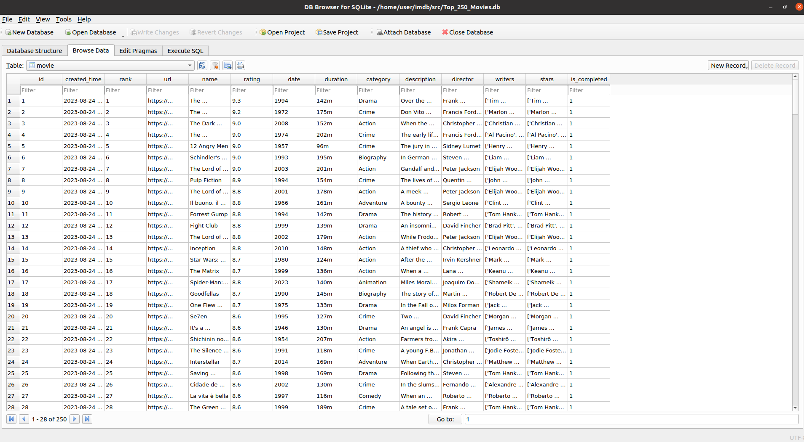

# IMDb Top 250 Movies Crawler and Database

<div style="margin-bottom: 20px;">
    <a href="https://www.imdb.com/chart/top/?ref_=nv_mv_250">
        
    </a>
</div>
<br>

A Python project that crawls information about the top 250 movies from IMDb and stores them in a `SQLite` database with the `PeeWee` ORM library. This project utilizes web scraping techniques to extract movie details such as rank, name, rating, date, duration, category, description, director, writers, and stars.

<div align="left">
  
  
  
</div>

## Table of Contents

## Table of Contents

- [Introduction](#introduction)
- [Features](#features)
- [Prerequisites](#prerequisites)
  - [Installing Python](#installing-python)
  - [Installing Python Packages](#installing-python-packages)
  - [Installing SQLite Database and DB Browser](#installing-sqlite-database-and-db-browser)
- [Project Structure](#project-structure)
- [Usage](#usage)
- [Logging Information](#logging-information)
- [Contributing](#contributing)
- [License](#license)


## Introduction

Welcome to the IMDb Top 250 Movies Crawler and Database project! This Python project provides an automated way to gather data about the top 250 movies from IMDb and store them in a local SQLite database using the `PeeWee ORM library` in Python. By utilizing web scraping techniques, this project extracts various movie details, making it a valuable resource for movie enthusiasts, data analysts, and researchers.

<a href="#">&#9650;Back</a>

## Features

- **Comprehensive Data Collection**: Automate the process of gathering detailed information about the top 250 movies from IMDb's list.
- **Web Scraping Techniques**: Utilize web scraping techniques to extract movie details including rank, name, rating, date, duration, category, description, director, writers, and stars.
- **SQLite Database Storage**: Store the collected movie information in a local SQLite database, enabling efficient querying and data management.
- **Informative Logging**: Keep track of the crawling process with informative logs, providing insights into the progress and status of the data collection.
- **Peewee ORM Integration**: Use the Peewee library, a powerful Object-Relational Mapping (ORM) tool, to interact with the SQLite database, abstracting database complexities and providing a more Pythonic approach to data manipulation.
- **Ease of Exploration**: Once data is collected, explore and analyze the information in the `Top_250_Movies.db` SQLite database.

<a href="#">&#9650;Back</a>

## Prerequisites

### Installing python
The project is developed using Python 3, so you'll need a compatible version of Python installed on your system. You can download the latest version of Python from the [official Python website](https://www.python.org/downloads/).

### Installing Python packages
The project relies on various Python packages for web scraping, database management, and more. You can install these required packages using the provided `requirements.txt` file. Run the following command to install them:

  ```sh
  pip install -r requirements.txt
```
  
### Installing SQLite Database and DB Browser

1. **Installing SQLite Database**: SQLite is a self-contained, serverless, and zero-configuration SQL database engine. It's likely already installed with your Python distribution. You can use this command to install it:
   ```sh
   sudo apt install sqlite3
   ```

3. **DB Browser for SQLite**: To interact with the SQLite database, you can use a graphical tool like [DB Browser for SQLite](https://sqlitebrowser.org/). It provides an intuitive interface for managing SQLite databases. You can use this command to install it:
```sh
   sudo apt install sqlitebrowser
```
<a href="#">&#9650;Back</a>

## Project Structure

The project follows a structured organization that separates different components and functionalities. Here's an overview of the project structure:

- **`main.py`**: The entry point of the project. It contains the main script to execute various actions, such as creating tables, crawling data, and displaying statistics.

- **`logger.py`**: This module sets up custom logging for different parts of the data processing. It configures console and file handlers with different logging levels.

- **`crawl.py`**: The script responsible for web scraping IMDb to gather movie information. It includes functions to retrieve both main page metadata and detailed movie page data.

- **`config.py`**: Contains project configuration variables, such as the base URL for IMDb's top 250 movies list.

- **`models.py`**: Defines the database models using the Peewee ORM library. It specifies the structure of the SQLite database tables.
  
<a href="#">&#9650;Back</a>

## Usage

1. Run the script `main.py` to perform various actions:
   - `create_tables`: Create the necessary database tables.
   - `crawl_main_page`: Crawl the main IMDb page to gather metadata.
     This command will save the names, ranks, ratings, and URLs of all the top 250 movies in the database. These URLs will be used in the next steps to crawl additional data for each movie.
   - `crawl_movies`: Crawl individual movie pages for detailed information.
   - `stats`: Display statistics about the crawled data.

2. Explore the `Top_250_Movies.db` SQLite database to access the collected movie information. The database looks like this:
<div style="margin-bottom: 20px;">
        
</div>
<br>
   
<a href="#">&#9650;Back</a>

## Logging Information

The project includes a logging system to provide informative output about the crawling process and other activities. Logs are helpful for tracking the progress, errors, and status of the data collection. The logging system is implemented using the `logger.py` module.

To access logs, you can check the `crawling_logs.txt` file to gain insights into the execution of different parts of the project. The logs are colored for better readability, with different colors representing different log levels.

<a href="#">&#9650;Back</a>

## Contributing

Contributions are welcome! If you have suggestions, improvements, or bug fixes, please feel free to open issues or pull requests.

<a href="#">&#9650;Back</a>

## License

This project is licensed under the MIT License. See the [LICENSE](LICENSE) file for details.

<a href="#">&#9650;Back</a>

---

<div align="center">
    Made with ❤️ by <a href=https://github.com/saeed-at>saeed-at</a>
</div>
